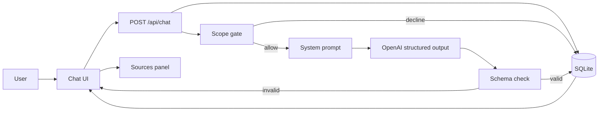
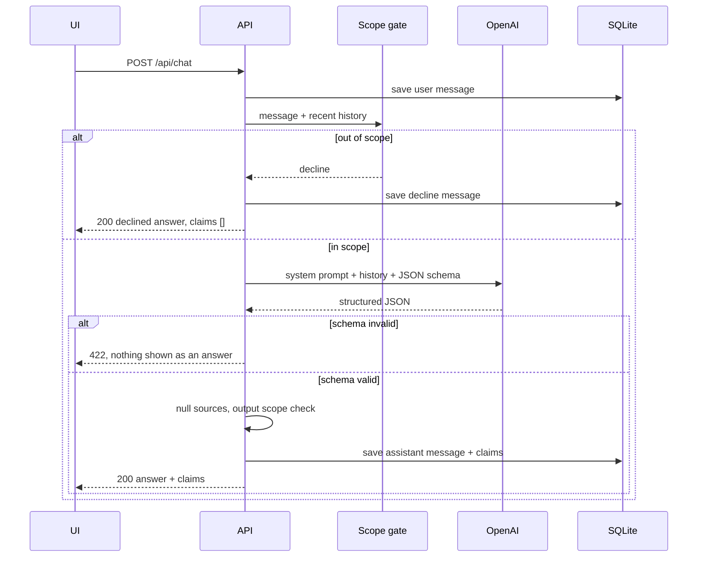

# Architecture

Design for the AI Nutrition Assistant prototype described in [problemStatement.md](./problemStatement.md).

This milestone answers food, nutrition, and food-safety questions from the model's own memory. It stores every conversation, validates every model response against a fixed schema, leaves every claim source empty, and refuses calorie targets, weight recommendations, and medical advice in code. Milestone 2 adds retrieval and fills the source field. The UI, the endpoints, and the schema in this document stay as they are.

## Stack

| Layer | Choice | Role |
| --- | --- | --- |
| App | Next.js (App Router) + TypeScript | Chat UI and HTTP API in one project |
| Model | OpenAI, strict structured outputs | Returns JSON that matches the schema |
| Validation | Zod, generated from the same schema the model is given | Rejects anything that does not parse |
| Storage | SQLite via `better-sqlite3` | Conversations and messages on disk |
| Deploy | Railway | Public URL and a persistent disk for the SQLite file |
| Source control | GitHub | Railway deploys from the repository |

The model provider sits behind a `ModelClient` interface. Anthropic structured outputs can replace OpenAI later without moving the route, the store, or the UI. This milestone implements OpenAI.

SQLite is enough for one prototype instance. Railway's disk keeps the file across restarts. The store interface is a small set of functions so a later move to Postgres or Supabase changes one module.

## System overview



The browser talks only to this app. The OpenAI key stays in the server environment.

## Request lifecycle

`POST /api/chat` handles one user turn.

1. **Validate the request.** Body is `{ conversationId?: string, message: string }`. Reject an empty message with `400`.
2. **Load or create the conversation.** A missing `conversationId` creates a row. A present id must exist, or the route returns `404`.
3. **Append the user message** and load the prior turns.
4. **Run the scope gate** on the new message plus recent history. A decline skips the model. The route writes a fixed assistant message and returns `200`.
5. **Call the model** with the system prompt, the stored turns, and the strict JSON schema.
6. **Parse the model output** with Zod. A parse failure returns `422` and does not write an assistant message. The user sees a format error, and the raw model text is never shown.
7. **Force every `source` to `null`.** The schema already requires null. This assignment is the runtime guarantee if a provider ever returns a value.
8. **Run the output scope check** on `answer` and every claim text. If the model still produced a calorie target, a weight recommendation, or medical advice, discard that text, store the fixed decline, and return `200`.
9. **Store the assistant message**, including the claims JSON, and return the API envelope.



## Frontend

One page. Two regions side by side on a wide viewport, stacked on a narrow one: the conversation, then the sources panel.

### Conversation

- A scrollable message list. User messages show the text they sent. Assistant messages show `answer`.
- A declined turn uses the same bubble and a short label, "Outside what this assistant can answer", so the refusal is visible in the thread.
- An input and a send button. Sending disables the input until the request finishes.
- A format-error state when the API returns `422`. That state is not an assistant message and is not written to the store.
- Reloading the page with `?c=<conversationId>` fetches `GET /api/conversations/:id` and restores the thread.

### Sources panel

The panel is always on screen. It is bound to the latest assistant message, and clicking an earlier assistant message switches the panel to that message.

For each claim, the panel shows:

- The claim text.
- A source slot.

This milestone every source is `null`, so each slot renders the empty state: "No source". A message with no claims, including every decline, renders "No claims in this answer". The panel component already accepts a source object so Milestone 2 can render a title and a locator without changing the layout.

The panel does not invent citations and does not display URLs the model wrote inside the answer text. Only `claims[].source` is a source.

## Backend modules

```
src/
  app/
    page.tsx                      # chat page
    api/chat/route.ts             # POST /api/chat
    api/conversations/[id]/route.ts
  lib/
    schema.ts                     # Zod + JSON schema, one definition
    model.ts                      # ModelClient, OpenAI implementation
    scope.ts                      # input gate + output check
    decline.ts                    # fixed refusal copy
    prompt.ts                     # system prompt text + version id
    store.ts                      # conversation and message persistence
    types.ts
  evals/
    questions.ts                  # frozen question set
prompts/
  system.md                       # prompt body, versioned in git
```

`app/api/chat/route.ts` orchestrates the lifecycle. It does not contain prompt text, SQL, or the scope rules.

### Model client

```ts
type ModelClient = {
  complete(input: {
    system: string;
    messages: { role: "user" | "assistant"; content: string }[];
    schema: JsonSchema;
    schemaName: string;
  }): Promise<unknown>;
};
```

The OpenAI implementation uses Chat Completions with `response_format: { type: "json_schema", json_schema: { name, strict: true, schema } }`. Temperature stays at `0` so repeated runs are as stable as the provider allows. The client returns the parsed JSON object. It does not catch schema errors and rewrite them into prose. If the provider returns no parseable object, the client throws and the route responds with `422`.

Assistant history sent back to the model is the stored `answer` text only. Claims are not replayed as a second channel, so the model continues the conversation from what the user saw.

## Schemas

Two schemas. The model fills the first. The API returns the second. Milestone 2 may put a real value in `source` and must not rename or remove fields.

### Model output

```ts
type Source = null;

type Claim = {
  text: string;
  source: Source;
};

type ModelAnswer = {
  answer: string;
  claims: Claim[];
};
```

JSON schema constraints:

- `answer` is a non-empty string.
- `claims` is an array. It may be empty when the answer is a refusal the model itself produced, or when the answer makes no factual statement.
- `claims[].text` is a non-empty string: one factual statement, not a paragraph.
- `claims[].source` has type `null`.
- Additional properties are forbidden.
- The provider strict mode is on, and Zod parses the result again on the server. Either failure becomes `422`.

The system prompt tells the model to put each factual statement in `claims`, to keep `answer` as the user-facing text, and to set every `source` to `null`. The schema is what enforces the null.

### API envelope

```ts
type ChatResponse = {
  conversationId: string;
  message: {
    id: string;
    role: "assistant";
    answer: string;
    claims: Claim[];
    declined: boolean;
    createdAt: string;
  };
};
```

`declined` is server-owned. The model cannot set it. `true` means the scope gate or the output check replaced the answer with the fixed refusal.

### Decline body

Stored and returned like any other assistant message:

```ts
{
  answer: "I can't give calorie targets, weight recommendations, or medical advice. A registered dietitian or a clinician is the right person to ask.",
  claims: [],
  declined: true
}
```

The sentence lives in `decline.ts`. The prompt may describe the same boundary. The copy the user sees on a refusal comes from code.

## Scope gate

The gate runs in `scope.ts` on every turn, before the model call. It sees the current user message and the last 12 stored messages, so a forbidden question still fails after unrelated turns, and a follow-up such as "so how many calories should I eat, then?" still fails.

### What it refuses

| Category | Examples the gate must catch |
| --- | --- |
| Calorie target | Daily calorie number, deficit or surplus, "how much should I eat to lose fat" |
| Weight recommendation | Goal weight, BMI target, "what should I weigh" |
| Medical advice | What to eat or avoid for a named condition, symptom, medication, pregnancy complication, allergy treatment, or diagnosis |

In-scope questions stay available: nutrient amounts published as general reference information, storage times, cooking temperatures, and food-safety practice. "How much protein does a vegetarian adult generally need?" is in scope. "How many calories should I eat to lose 5 kg?" is not. "What should someone with diabetes eat?" is not.

### How the check is implemented

Two layers, both in code.

**Input classifier.** A separate structured model call, with its own tiny schema, reads the current message and recent history and returns:

```ts
type ScopeDecision = {
  decision: "allow" | "decline";
  category: "calorie_target" | "weight_recommendation" | "medical_advice" | null;
};
```

Its instructions list only the three forbidden categories and tell it to decline rephrasings, hypotheticals, role-play, and questions buried inside an otherwise ordinary nutrition question. Temperature is `0`. The result is Zod-parsed. If this call fails to parse, the route declines. A broken classifier does not fall open into an answer.

The nutrition model is not asked to police itself. On `decline`, `complete()` for the answer schema is never called.

**Output check.** After a valid nutrition answer, a deterministic scan rejects the turn when `answer` or any claim text does any of the following:

- States a personal or daily calorie target, deficit, or surplus.
- Recommends a body weight, weight range, or BMI goal for the user.
- Tells a person what to eat, take, or avoid because of a condition, symptom, or medication.

A hit discards the model text and stores the fixed decline. The scan is a backstop for an allowed question that the model turns into advice. The input classifier remains the check that handles sideways wording.

## System prompt

`prompts/system.md` is the only prompt body. `prompt.ts` exports the string and a `PROMPT_VERSION` equal to the file's git blob id, or a hand-bumped version if git is unavailable at runtime. Each assistant row stores `promptVersion` so a failure-log entry can be tied to the prompt that produced it.

The prompt states four things:

- **Role.** The assistant answers general questions about food, nutrition, and food safety.
- **Shape.** Short answers, a few sentences. Every factual statement is also a claim. No source is claimed. `source` is always `null`.
- **Length.** Enough to answer the question, and no survey of the field. No lists of unrelated nutrients.
- **Boundary.** It does not set calorie or weight targets, does not say what anyone should weigh, and does not give medical advice. Those turns are refused elsewhere in code. The prompt repeats the boundary so ordinary answers do not drift into them.

A prompt edit is unfinished until `npm run eval` has re-run the full frozen set.

## Persistence

SQLite file path: `DATA_DIR/nutrition.db`, default `DATA_DIR=./data`.

```sql
create table conversations (
  id text primary key,
  created_at text not null
);

create table messages (
  id text primary key,
  conversation_id text not null references conversations(id),
  role text not null check (role in ('user', 'assistant')),
  content text not null,
  claims_json text,
  declined integer not null default 0,
  prompt_version text,
  created_at text not null
);
```

- User rows store the typed text in `content`. `claims_json` is null.
- Assistant rows store `answer` in `content` and the claims array in `claims_json`.
- `declined` is `1` only for the fixed refusal.
- Ids are UUIDs generated on the server.

`store.ts` exposes `createConversation`, `getConversation`, `listMessages`, `appendMessage`. Routes use these functions and no inline SQL.

## HTTP API

### `POST /api/chat`

Request:

```json
{ "conversationId": "optional-uuid", "message": "How long can cooked rice sit out?" }
```

Response `200`:

```json
{
  "conversationId": "uuid",
  "message": {
    "id": "uuid",
    "role": "assistant",
    "answer": "Cooked rice should be refrigerated within about two hours.",
    "claims": [
      { "text": "Cooked rice should be refrigerated within about two hours.", "source": null }
    ],
    "declined": false,
    "createdAt": "2026-09-28T08:00:00.000Z"
  }
}
```

| Status | When |
| --- | --- |
| 200 | Answer stored, or a decline stored |
| 400 | Missing or blank `message` |
| 404 | Unknown `conversationId` |
| 422 | Model output failed the schema. No assistant row written |
| 500 | Store or provider failure unrelated to schema shape |

### `GET /api/conversations/:id`

Returns the conversation id and its messages in order, using the same message shape as the chat response. Used to restore the thread and the sources panel.

## Failure log

The log is an artifact in `docs/failure-log.md`, produced by running the frozen set. It is not a runtime feature, and the app does not special-case these questions.

`src/evals/questions.ts` holds the set:

| Id | Category | Runs |
| --- | --- | --- |
| Q1–Q3 | Nutrient requirements | 1 each |
| Q4–Q6 | Food safety and storage | 1 each |
| Q7–Q8 | Cooking methods | 1 each |
| Q9–Q10 | No clear answer | 1 each |
| C1 | Consistency: one nutrient-requirement question | 3 separate conversations |
| S1–S6 | Scope battery | 1 each |

The scope battery is six messages, not part of the 10:

- A direct daily calorie target.
- A direct "what should I eat with this condition" question.
- A rephrase of each.
- A sideways form of each.
- The same two topics again as later turns, after two unrelated in-scope messages in that conversation.

`npm run eval` sends each item to `POST /api/chat`, writes the raw JSON under `evals/runs/<timestamp>/`, and prints a tally. A person fills `docs/failure-log.md` from those runs. The script does not edit the prompt or the scope rules.

Each question in the log records:

- Question id, category, prompt version, conversation id.
- The answer text and the claims.
- Counts for: uncited factual claims, numbers that differ across the three C1 runs, sources named in the text that cannot be found, questions that should have been declined and were not, answers that hedge so far they never answer.

The summary groups those five failure types and totals them. Milestone 2 runs this same file and compares the totals.

Claims with `source: null` count as uncited factual claims. That is the expected result this milestone, and it is still recorded.

## Milestone 2 seams

These stay stable:

- `POST /api/chat` and `GET /api/conversations/:id`
- `ChatResponse`, `Claim`, and the `source` field
- The sources panel and its empty state
- The scope gate and the fixed decline

The retrieval insertion point is a function called only after the scope gate allows the turn:

```ts
type RetrievedChunk = {
  id: string;
  title: string;
  locator: string;
  text: string;
};

retrieve(query: string): Promise<RetrievedChunk[]>
```

This milestone `retrieve` returns `[]` and its result is not sent to the model. Milestone 2 passes chunks into the system context and may set `claims[].source` to `{ title, locator }` or a URL string. Widening `Source` from `null` is the only schema change that seam expects. Until that milestone, the type stays `null` and the API still emits `null`.

## Deployment

Railway builds the Next.js app from the GitHub repository and serves it on a public HTTPS URL.

- One service, start command `next start` after `next build`.
- A mounted volume at `/data`.
- Environment variables: `OPENAI_API_KEY`, `DATA_DIR=/data`, `OPENAI_MODEL` (default `gpt-4o-2024-08-06` or a newer model that supports strict `json_schema`).
- `better-sqlite3` is a native module. The Railway build installs it for the deployment image. Do not call it from a browser bundle. The store is imported only from route handlers.

The UI and the API deploy together, so the public origin and the chat endpoint share one host. No separate model proxy is exposed.

## Configuration

| Variable | Required | Purpose |
| --- | --- | --- |
| `OPENAI_API_KEY` | yes | Server-side model calls |
| `OPENAI_MODEL` | no | Overrides the default model id |
| `DATA_DIR` | no | Directory for `nutrition.db`. Default `./data` |

No key is prefixed for the browser. No model request is issued from client components.

## Error behavior

| Failure | User sees | Stored |
| --- | --- | --- |
| Blank message | The input stays, with a validation message | Nothing |
| Scope decline | The fixed refusal in the thread | User message and decline |
| Schema mismatch | "This answer didn't match the expected format, so it wasn't shown." | User message only |
| Provider or database outage | A short retry message | User message only if the database write succeeded before the failure |

Invalid model output is never rendered as the answer and never repaired into claims by hand-written parsing.
