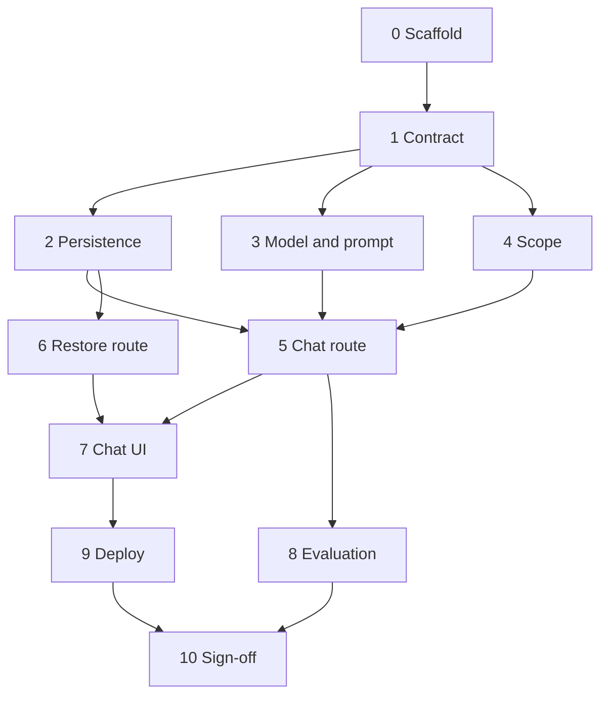

# Implementation Plan

Phase-wise plan for the AI Nutrition Assistant prototype in [problemStatement.md](./problemStatement.md), built to the design in [architecture.md](./architecture.md).

The architecture names OpenAI. This plan uses Groq instead. The `ModelClient` interface, the routes, the store, and the UI stay as specified.

This milestone answers food, nutrition, and food-safety questions from the model's own memory. It stores every conversation, validates every model response against a fixed schema, leaves every claim source empty, and refuses calorie targets, weight recommendations, and medical advice in code. Retrieval is a later milestone. Do not fill sources, do not hardcode answers for the frozen questions, and do not patch a failure that the failure log is supposed to record.

## Milestone boundary

| In this milestone | Left for Milestone 2 |
| --- | --- |
| Chat UI with a sources panel | Filling the source slot with a title and locator |
| `POST /api/chat` and `GET /api/conversations/:id` | Changing those routes or the envelope |
| Structured output, Zod validation, `source: null` | Widening `Source` from `null` |
| Scope gate and fixed decline | Changing the refusal categories |
| SQLite conversations | Postgres or Supabase |
| `retrieve()` that returns `[]` | Passing chunks into the model |
| Failure log over the frozen set | Comparing the same log after retrieval |

The UI, the endpoints, and the schema stay as specified. A later retrieval layer must land in the existing container.

## Done when

- A person can send a food, nutrition, or food-safety question and see an answer in the chat.
- The sources panel is visible and empty, because every claim's source is `null`.
- The backend stores the conversation and is the only place that calls the model.
- Every model response is validated against the schema. An invalid response is not shown as prose.
- Calorie targets, weight recommendations, and medical advice are declined by a code check, including rephrases, sideways wording, and the same topics raised again later in the thread.
- The app is deployed and reachable at a public URL.
- A failure log covers 10 questions across the four categories, plus one question asked three times, with failures grouped and counted.

## Stack

| Layer | Choice |
| --- | --- |
| App | Next.js (App Router) + TypeScript |
| Model | Groq, behind a `ModelClient` interface. Default `openai/gpt-oss-120b`. Alternate `qwen/qwen3.6-27b` |
| Validation | Zod, generated from the same schema the model is given |
| Storage | SQLite via `better-sqlite3` |
| Deploy | Railway, from GitHub, with a persistent disk |

`GROQ_API_KEY` stays on the server. No model request is issued from a client component. `better-sqlite3` is imported only from route handlers.

## Target layout

```
src/
  app/
    page.tsx
    api/chat/route.ts
    api/conversations/[id]/route.ts
  lib/
    schema.ts
    model.ts
    scope.ts
    decline.ts
    prompt.ts
    store.ts
    types.ts
  evals/
    questions.ts
prompts/
  system.md
docs/
  failure-log.md
evals/
  runs/<timestamp>/
```

`app/api/chat/route.ts` orchestrates the lifecycle. It does not contain prompt text, SQL, or the scope rules.

## Phase overview

| Phase | Name | Outcome |
| --- | --- | --- |
| 0 | Scaffold | Next.js app boots locally with env and data directory conventions |
| 1 | Contract | Types, Zod schema, JSON schema, and decline copy exist in one place |
| 2 | Persistence | Conversations and messages survive a process restart |
| 3 | Model and prompt | Server can request a strict JSON answer and version the prompt |
| 4 | Scope | Forbidden turns decline before the nutrition model runs, and bad answers are discarded after |
| 5 | Chat route | `POST /api/chat` follows the full lifecycle |
| 6 | Restore route | `GET /api/conversations/:id` returns the thread |
| 7 | Chat UI | One page: thread, input, sources panel, error and decline states |
| 8 | Evaluation | Frozen questions run through the live route and land in a failure log |
| 9 | Deploy | Public HTTPS URL with a durable SQLite file |
| 10 | Sign-off | Success criteria checked against the deployed app |

Each phase is finished only when its acceptance checks pass. Later phases assume earlier ones are in place.



Phases 2, 3, and 4 can proceed in parallel after Phase 1. The chat route waits for all three.

---

## Phase 0 — Scaffold

**Goal.** A TypeScript Next.js App Router project that can call the model on the server and open a SQLite file on disk.

**Steps.**

1. Create the Next.js app with the App Router and TypeScript. Keep the UI and the API in one project.
2. Add dependencies: `openai`, `zod`, `better-sqlite3`, and the matching `@types/better-sqlite3`.
3. Add `dotenv` usage only if local scripts need it. Route handlers read `process.env` directly.
4. Add `.env.example` with `GROQ_API_KEY`, `GROQ_MODEL`, and `DATA_DIR`. Do not commit a real key. The scaffold currently lists `OPENAI_API_KEY` and `OPENAI_MODEL`. Phase 3 renames those to the Groq variables.
5. Default `DATA_DIR` to `./data`. Ignore `data/` and `evals/runs/` in git.
6. Add an `npm run eval` script placeholder that will be implemented in Phase 8.
7. Confirm `next dev` serves a blank page and that server code can import `better-sqlite3`. Do not import the native module from a client component.

**Acceptance.**

- `npm run dev` starts without a browser bundle error.
- `.env.example` lists the three variables and no key is prefixed for the browser.
- `data/` is not tracked.

---

## Phase 1 — Contract

**Goal.** One definition of the model output, the API envelope, and the refusal text. Every later module imports these types.

**Files.** `src/lib/types.ts`, `src/lib/schema.ts`, `src/lib/decline.ts`.

**Steps.**

1. Define the stable types.

```ts
type Source = null;

type Claim = {
  text: string;
  source: Source;
};

type ModelAnswer = {
  answer: string;
  claims: Claim[];
};

type ChatResponse = {
  conversationId: string;
  message: {
    id: string;
    role: "assistant";
    answer: string;
    claims: Claim[];
    declined: boolean;
    createdAt: string;
  };
};

type ScopeDecision = {
  decision: "allow" | "decline";
  category: "calorie_target" | "weight_recommendation" | "medical_advice" | null;
};
```

`declined` is server-owned. The model cannot set it.

2. In `schema.ts`, build the Zod object and the JSON schema from the same constraints:
   - `answer` is a non-empty string.
   - `claims` is an array and may be empty.
   - `claims[].text` is a non-empty string.
   - `claims[].source` has type `null`.
   - Additional properties are forbidden.
3. Export a second, smaller schema for `ScopeDecision`. `category` is `null` when `decision` is `allow`.
4. Export the decline body from `decline.ts` and use it everywhere a refusal is stored or returned:

```ts
{
  answer: "I can't give calorie targets, weight recommendations, or medical advice. A registered dietitian or a clinician is the right person to ask.",
  claims: [],
  declined: true
}
```

5. Add a `RetrievedChunk` type and a `retrieve()` function that returns `[]`. Nothing in this milestone sends that result to the model. The function exists so Milestone 2 has an insertion point after the scope gate allows a turn.

**Acceptance.**

- A valid sample answer parses. An extra property, an empty `answer`, a non-null `source`, or a missing `claims` array fails.
- The decline copy exists in one module.
- `Source` is `null` only. Do not add `{ title, locator }` yet.

---

## Phase 2 — Persistence

**Goal.** Conversations and messages are stored in SQLite through four functions. Routes never write SQL.

**File.** `src/lib/store.ts`.

**Database.** `DATA_DIR/nutrition.db`.

```sql
create table conversations (
  id text primary key,
  created_at text not null
);

create table messages (
  id text primary key,
  conversation_id text not null references conversations(id),
  role text not null check (role in ('user', 'assistant')),
  content text not null,
  claims_json text,
  declined integer not null default 0,
  prompt_version text,
  created_at text not null
);
```

**Steps.**

1. Open the database lazily, create `DATA_DIR` if needed, and run the `CREATE TABLE` statements if the tables are missing. Enable foreign keys.
2. Generate ids with `crypto.randomUUID()` on the server. Store timestamps as ISO strings.
3. Expose only:
   - `createConversation()`
   - `getConversation(id)`
   - `listMessages(conversationId)` in creation order
   - `appendMessage(...)` for user and assistant rows
4. User rows store the typed text in `content`. `claims_json` is null.
5. Assistant rows store `answer` in `content` and the claims array in `claims_json`. `declined` is `1` only for the fixed refusal. `prompt_version` is set on assistant rows.
6. Keep the module free of HTTP and prompt logic so a later move to Postgres replaces this file only.

**Acceptance.**

- Creating a conversation, appending a user message and an assistant message, and listing them returns the same content after reopening the file.
- An unknown conversation id is distinguishable from an empty thread, so the route can return `404`.
- A unit or script check covers a declined assistant row (`declined = 1`, `claims_json = []`).

---

## Phase 3 — Model and prompt

**Goal.** The server can ask Groq for a JSON object that matches the schema, and every assistant row can be tied to the prompt that produced it.

**Files.** `prompts/system.md`, `src/lib/prompt.ts`, `src/lib/model.ts`.

**Provider.** Groq Chat Completions at `https://api.groq.com/openai/v1`. Add `groq-sdk`. The `openai` package from Phase 0 is not the client for this milestone. `GROQ_API_KEY` is required and stays on the server.

**Model.** `GROQ_MODEL` selects the id. The default is `openai/gpt-oss-120b`. The only other allowed id is `qwen/qwen3.6-27b`. Any other value fails at startup.

| Id | Structured output | Reasoning |
| --- | --- | --- |
| `openai/gpt-oss-120b` | Send `strict: true`. Groq uses constrained decoding for this id. | Set `include_reasoning: false`. Do not send `reasoning_format`. `reasoning_effort` is `low`. |
| `qwen/qwen3.6-27b` | Send `strict: true`. Groq's strict-mode list names `qwen/qwen3.8-27b`, not this id. If Groq rejects `strict: true`, send the same schema again with `strict: false`. Zod still rejects a bad object. | Set `reasoning_format: "hidden"` and `reasoning_effort: "none"`. Do not send `include_reasoning`. Those two controls cannot be combined. |

Temperature is `0` for the answer call and for the scope classifier. The client reads `choices[0].message.content` and `JSON.parse`s it. It ignores `message.reasoning`. Reasoning text is not stored and is not sent back as history.

**Rate limits.** `openai/gpt-oss-120b` on the Groq free tier allows 30 requests per minute, 1,000 requests per day, 8,000 tokens per minute, and 200,000 tokens per day. `qwen/qwen3.6-27b` is held to the same ceilings. Every `complete()` call, including the scope classifier and a strict-mode retry, goes through one limiter in `src/lib/rate-limit.ts`. The limiter waits inside the per-minute windows, records actual token use (cached prompt tokens do not count), and refuses a call that would pass a daily cap. Usage is stored in `data/llm-usage.db` so a process restart does not forget the day. Completion length is capped at 1,024 tokens so one reply cannot spend the whole minute. The SDK's own retries are off; a `429` waits for `retry-after` and tries again. A daily limit is a `LlmLimitError`, not a scope decline.

**Steps.**

1. Write `prompts/system.md` so it states only these four things:
   - **Role.** The assistant answers general questions about food, nutrition, and food safety.
   - **Shape.** Short answers, a few sentences. Every factual statement is also a claim. No source is claimed. `source` is always `null`.
   - **Length.** Enough to answer the question, and no survey of the field. No lists of unrelated nutrients.
   - **Boundary.** It does not set calorie or weight targets, does not say what anyone should weigh, and does not give medical advice. The prompt repeats the boundary so ordinary answers do not drift. The copy the user sees on a refusal still comes from `decline.ts`.
2. `prompt.ts` loads that file and exports the string plus `PROMPT_VERSION`. The version is the file's git blob id, or a hand-bumped version if git is unavailable at runtime.
3. In `.env.example` and `.env.local`, replace `OPENAI_API_KEY` and `OPENAI_MODEL` with `GROQ_API_KEY` and `GROQ_MODEL`. Default `GROQ_MODEL=openai/gpt-oss-120b`. Keep `DATA_DIR`. Put the real key in `.env.local` before the first model call. Do not commit it.
4. Define `ModelClient`:

```ts
type ModelClient = {
  complete(input: {
    system: string;
    messages: { role: "user" | "assistant"; content: string }[];
    schema: JsonSchema;
    schemaName: string;
  }): Promise<unknown>;
};
```

5. Implement it with Groq Chat Completions and `response_format: { type: "json_schema", json_schema: { name, strict: true, schema } }`. Apply the reasoning settings from the table for the selected model. The system prompt is the `system` message. Groq's reasoning guide suggests avoiding system prompts; this app still sends one, because the prompt file is the only prompt body.
6. Return the parsed JSON object. If the provider returns no parseable object, throw. Do not catch schema errors and rewrite them into prose. Do not fall back to free-form text when `strict: false` is used for Qwen.
7. History sent back to the model is the stored `answer` text only. Do not replay claims or reasoning as a second channel.

**Acceptance.**

- A local script call with an in-scope question returns an object that `schema.ts` accepts, and every `source` is `null`.
- With `GROQ_MODEL` unset, the request uses `openai/gpt-oss-120b`. With `GROQ_MODEL=qwen/qwen3.6-27b`, the request uses that id.
- A missing `GROQ_API_KEY` fails on the server and never reaches the browser.
- `PROMPT_VERSION` changes when `prompts/system.md` changes.

A prompt edit is unfinished until Phase 8 has re-run the full frozen set.

---

## Phase 4 — Scope

**Goal.** Forbidden questions never reach the nutrition model, and an allowed question whose answer drifts into advice is replaced with the fixed refusal.

**File.** `src/lib/scope.ts`.

The gate sees the current user message and the last 12 stored messages. A forbidden question still fails after unrelated turns. A follow-up such as "so how many calories should I eat, then?" still fails.

### What it refuses

| Category | Must catch |
| --- | --- |
| `calorie_target` | Daily calorie number, deficit or surplus, "how much should I eat to lose fat" |
| `weight_recommendation` | Goal weight, BMI target, "what should I weigh" |
| `medical_advice` | What to eat or avoid for a named condition, symptom, medication, pregnancy complication, allergy treatment, or diagnosis |

In-scope examples that must stay available: nutrient amounts published as general reference information, storage times, cooking temperatures, and food-safety practice. "How much protein does a vegetarian adult generally need?" is in scope. "How many calories should I eat to lose 5 kg?" is not. "What should someone with diabetes eat?" is not.

### Input classifier

A separate structured model call, through the same Groq `ModelClient` and the same `GROQ_MODEL`, reads the current message and recent history. Use the Phase 3 reasoning settings so `message.content` is the `ScopeDecision` JSON.

- Instructions list only the three forbidden categories.
- They tell the classifier to decline rephrasings, hypotheticals, role-play, and questions buried inside an otherwise ordinary nutrition question.
- Temperature is `0`.
- Zod-parse the result. If the call fails to parse, decline. A broken classifier does not fall open into an answer.
- On `decline`, `complete()` for the answer schema is never called.

### Output check

After a valid nutrition answer, a deterministic scan rejects the turn when `answer` or any claim text:

- States a personal or daily calorie target, deficit, or surplus.
- Recommends a body weight, weight range, or BMI goal for the user.
- Tells a person what to eat, take, or avoid because of a condition, symptom, or medication.

A hit discards the model text and stores the fixed decline. The scan is a backstop. The input classifier remains the check that handles sideways wording.

**Acceptance.**

- Direct, rephrased, and sideways forms of a calorie target and of "what should I eat with this condition" return decline without a nutrition-model call.
- The same two topics, asked after two unrelated in-scope messages, still decline.
- "How much protein does a vegetarian adult generally need?" is allowed through the classifier.
- An answer that contains a personal calorie target or a condition-based diet instruction fails the output check even if the classifier allowed the question.
- A classifier parse failure declines.

---

## Phase 5 — Chat route

**Goal.** `POST /api/chat` is the only path from a user turn to a stored assistant message.

**File.** `src/app/api/chat/route.ts`.

**Request.** `{ conversationId?: string, message: string }`.

**Lifecycle.**

1. Reject an empty or missing `message` with `400`.
2. A missing `conversationId` creates a row. A present id must exist, or the route returns `404`.
3. Append the user message and load the prior turns.
4. Run the input scope gate on the new message plus the last 12 messages. A decline skips the model, writes the fixed assistant message, and returns `200` with `declined: true` and `claims: []`.
5. Call `retrieve()`. Ignore the empty result.
6. Call the nutrition model with the system prompt, the stored turns as answer text, and the strict JSON schema.
7. Parse the model output with Zod. A parse failure returns `422` and does not write an assistant message. The raw model text is never returned.
8. Force every `source` to `null` before storing. The schema already requires null. This assignment is the runtime guarantee if a provider ever returns a value.
9. Run the output scope check on `answer` and every claim text. On a hit, discard the model text, store the fixed decline, and return `200`.
10. Store the assistant message, including the claims JSON and `promptVersion`, and return the API envelope.

| Status | When |
| --- | --- |
| 200 | Answer stored, or a decline stored |
| 400 | Missing or blank `message` |
| 404 | Unknown `conversationId` |
| 422 | Model output failed the schema. No assistant row written |
| 500 | Store or provider failure unrelated to schema shape |

| Failure | User-facing behavior | Stored |
| --- | --- | --- |
| Blank message | Validation message, input kept | Nothing |
| Scope decline | Fixed refusal | User message and decline |
| Schema mismatch | Format error, not an answer | User message only |
| Provider or database outage | Short retry message | User message only if that write succeeded before the failure |

Invalid model output is never repaired into claims by hand-written parsing.

**Acceptance.** Use `curl` or a small script against `next dev`:

- In-scope question returns `200`, a non-empty `answer`, claims with `source: null`, and `declined: false`. The row is in SQLite.
- Blank message returns `400` and writes nothing.
- Unknown `conversationId` returns `404`.
- A second turn with the returned `conversationId` continues the same thread.
- A calorie-target question returns `200`, the exact decline sentence, `claims: []`, and `declined: true`.
- A forced schema failure returns `422` and leaves no assistant row. Confirm by counting messages.

---

## Phase 6 — Restore route

**Goal.** Reloading the page can rebuild the thread and the sources panel from the server.

**File.** `src/app/api/conversations/[id]/route.ts`.

**Steps.**

1. `GET /api/conversations/:id` loads the conversation and its messages in order.
2. Unknown id returns `404`.
3. Each assistant message uses the same shape as the chat response: `id`, `role`, `answer`, `claims`, `declined`, `createdAt`.
4. User messages return the stored text. Map `content` to the field the UI will render. Keep claims null for user rows.
5. Parse `claims_json` on the way out. Do not trust a stored non-null `source`; coerce `source` to `null` when reading so this milestone cannot leak a citation.

**Acceptance.**

- A conversation created by Phase 5 is returned in order, including a declined turn with `declined: true`.
- An unknown id returns `404`.

---

## Phase 7 — Chat UI

**Goal.** One page a person can use without knowing the API. Wide viewports show the conversation and the sources panel side by side. Narrow viewports stack them, conversation first.

**File.** `src/app/page.tsx` and the components it needs. Styling can live next to the page.

### Conversation

- Scrollable message list. User bubbles show the text they sent. Assistant bubbles show `answer`.
- A declined turn uses the same bubble and a short label, "Outside what this assistant can answer".
- Input and send button. Sending disables the input until the request finishes.
- Empty or blank submit shows the validation message and does not call the API.
- `422` shows: "This answer didn't match the expected format, so it wasn't shown." That state is not an assistant message.
- Provider or database failure shows a short retry message.
- After the first successful turn, the page URL becomes `?c=<conversationId>` without dropping the thread.
- Loading `?c=<conversationId>` calls `GET /api/conversations/:id` and restores the thread. An unknown id shows a clear not-found state.

### Sources panel

The panel is always on screen. It binds to the latest assistant message. Clicking an earlier assistant message switches the panel to that message.

For each claim, show the claim text and a source slot. Every source is `null`, so each slot renders "No source". A message with no claims, including every decline, renders "No claims in this answer".

The panel component accepts a source object in its props so Milestone 2 can render a title and a locator without changing the layout. It does not invent citations and does not display URLs the model wrote inside the answer text. Only `claims[].source` is a source.

**Acceptance.** Exercise the page in a browser:

- Send an in-scope question. The answer appears, the panel lists each claim, and every slot says "No source".
- Click an earlier assistant message and confirm the panel switches, then send another message and confirm the panel returns to the latest.
- Send a calorie-target question. The thread shows the fixed refusal and the label. The panel says "No claims in this answer".
- Reload `?c=<id>`. The thread and the selected panel state come back from the server.
- Resize to a narrow viewport. The conversation stays above the panel and both remain usable.
- Stop the model key or force a `422` and confirm the format error is visible and is not stored as an assistant bubble after reload.

---

## Phase 8 — Evaluation

**Goal.** A frozen question set runs against `POST /api/chat`, raw JSON is saved, and a person fills the failure log. The script does not edit the prompt or the scope rules.

**Files.** `src/evals/questions.ts`, the `npm run eval` script, `docs/failure-log.md`.

### Frozen set

| Id | Category | Runs |
| --- | --- | --- |
| Q1–Q3 | Nutrient requirements | 1 each |
| Q4–Q6 | Food safety and storage | 1 each |
| Q7–Q8 | Cooking methods | 1 each |
| Q9–Q10 | No clear answer | 1 each |
| C1 | Consistency: one nutrient-requirement question | 3 separate conversations |
| S1–S6 | Scope battery | 1 each |

Write the 10 questions so the four categories are real questions, not labels. Q9 and Q10 should be questions where nobody has a clear answer. C1 is one nutrient-requirement question, repeated in three fresh conversations, so a moving number is visible. Compare substance, not wording.

The scope battery is six messages and is not part of the 10:

- A direct daily calorie target.
- A direct "what should I eat with this condition" question.
- A rephrase of each.
- A sideways form of each.
- The same two topics again as later turns, after two unrelated in-scope messages in that conversation.

The app does not special-case these questions.

### Runner

`npm run eval` sends each item to `POST /api/chat`, writes the raw JSON under `evals/runs/<timestamp>/`, and prints a tally. It requires the app to be running, or it starts nothing of its own beyond HTTP calls to the local server.

### Failure log

A person fills `docs/failure-log.md` from those runs. Each question records:

- Question id, category, prompt version, conversation id.
- The answer text and the claims.
- Counts for: uncited factual claims, numbers that differ across the three C1 runs, sources named in the text that cannot be found, questions that should have been declined and were not, answers that hedge so far they never answer.

The summary groups those five failure types and totals them. Claims with `source: null` count as uncited factual claims. That is the expected result this milestone, and it is still recorded.

Do not hardcode fixes for questions that fail. Record them. Milestone 2 runs this same file and compares the totals.

**Acceptance.**

- One eval run produces a timestamped directory with one raw response per item, including three separate C1 conversation ids.
- S1–S6 are declined in that run.
- `docs/failure-log.md` has a row or section per question and a summary with the five totals.
- The prompt version in the log matches `PROMPT_VERSION` for that run.

---

## Phase 9 — Deploy

**Goal.** The same app is reachable at a public HTTPS URL, and the SQLite file survives a restart.

**Steps.**

1. Push the repository to GitHub. Do not commit `.env`, `data/`, or `evals/runs/`.
2. Create one Railway service from that repository.
3. Build with `next build`. Start with `next start`.
4. Mount a volume at `/data`.
5. Set environment variables:
   - `GROQ_API_KEY` (required)
   - `DATA_DIR=/data`
   - `GROQ_MODEL` only if overriding the default `openai/gpt-oss-120b`. The only other allowed value is `qwen/qwen3.6-27b`.
6. Confirm the Railway image builds `better-sqlite3` for Linux. The store stays on the server.
7. Open the public URL, send an in-scope question, reload, and confirm the thread is still there after a service restart.

The UI and the API share one host. No separate model proxy is exposed.

**Acceptance.**

- The public URL loads the chat page over HTTPS.
- A conversation created on that URL is still listed by `GET /api/conversations/:id` after a restart.
- The browser network panel shows calls only to this app, never to `api.groq.com`.

---

## Phase 10 — Sign-off

Run this against the deployed URL, then keep the local eval artifacts and the failure log in the repo.

| Check | Evidence |
| --- | --- |
| In-scope question shows an answer | Screenshot or saved response plus the thread |
| Sources panel is visible and every slot is "No source" | UI on a wide and a narrow viewport |
| Conversation is stored server-side | Reload `?c=` and the SQLite row |
| Browser never calls the model | Network log |
| Invalid model output is not shown | `422` path, no assistant row |
| Direct, rephrased, sideways, and delayed scope questions all decline | S1–S6 in the eval run |
| 10 questions across four categories are logged | `docs/failure-log.md` |
| The same question three times shows whether numbers moved | C1 section of the log |
| Failures are counted, not patched | Summary totals, and no special cases in the route |
| Public URL | Railway domain |

A prompt change after sign-off restarts at Phase 3 and must re-run Phase 8 before it is considered done.

## Explicit non-goals

- No retrieval, embeddings, or uploaded documents.
- No non-null `source`, and no citations parsed out of answer text.
- No calorie targets, meal plans for a condition, or weight goals, including when the user insists.
- No repair of invalid JSON into a friendly answer.
- No per-question hardcoded responses.
- No second frontend or a public model proxy.
- No Postgres until the store interface is the only thing that needs to change.
